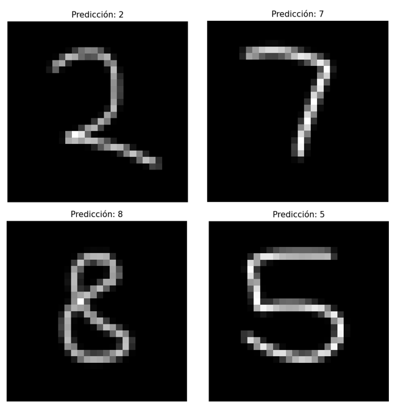

<h1>Red Neuronal: MNIST</h1>

Se exponen resultados y arquitectura de una red entrenada para la clasificación de números escritos a mano.

<h2>Resultados de Predicción</h2>

  

  Ejemplos de predicciones del modelo sobre el conjunto de prueba.

<h2>Arquitectura de la Red</h2>

  

<h3 align="center">Conv-2</h3>

  

  Representación de la parte densa de la red (Fully Connected + Softmax).

<h2>Referencias</h2>

Este proyecto está basado en conceptos del trabajo de  
Michael Nielsen en <em>Neural Networks and Deep Learning</em>.

Fuente original: 
<a href="https://github.com/mnielsen/neural-networks-and-deep-learning" target="_blank">
https://github.com/mnielsen/neural-networks-and-deep-learning
</a>

